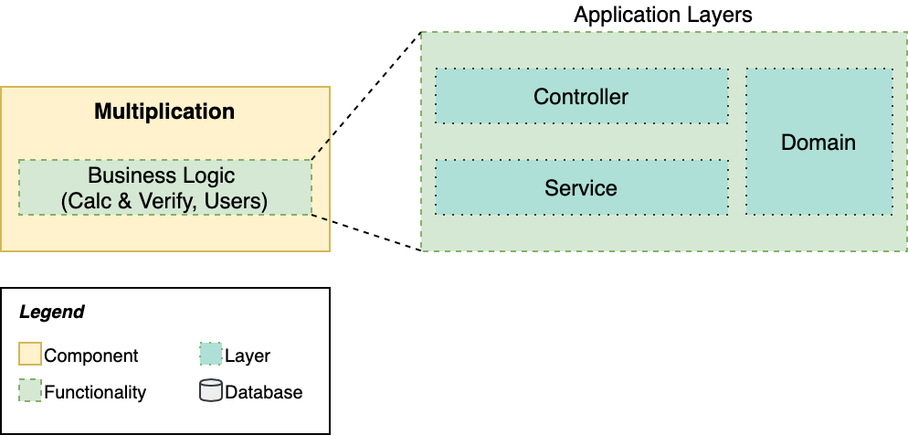

# Learn Microservices with Spring Boot 3 (3rd edition) - Chapter 3
This repository contains the source code of the practical use case described in the book [Learn Microservices with Spring Boot 3 (3rd Edition)](https://link.springer.com/book/10.1007/978-1-4842-9757-5)
.
The book follows a pragmatic approach to building a Microservice Architecture. You start with a small monolith and examine the pros and cons that come with a move to microservices.

## Chapter 3 version
In Chapter 3, the goal is to build a Spring Boot application according to good practices:
* _Domain-Driven Design_. We analyze the boundaries of the Users and Challenges domains.
* _3-layer Application Design_. This chapter focuses on two of the layers: Controller, and Service.
* _Test-Driven Development_. You write tests before building the functionalities.
* _Monolith First_. We keep two domains separate by using different root packages.

The next figure shows the status of the Multiplication application by the end of the Chapter, as it's also included in this repository.



There are two functional domains included in this first application: Users, and Challenges. See the figure below.


## Running the app
Note: You need to use JDK version 17 to run this project.

To start the Spring Boot application, you can use the command line with the included Maven wrapper:
```
$ ./mvnw spring-boot:run
```
## Questions
* Do you have questions about how to make this application work?
* Did you get the book and have questions about any concept explained within this chapter?
* Have you found issues using updated dependencies?
Don't hesitate to create an issue in this repository and post your question/problem there.

## About the book
Are you interested in building a microservice architecture from scratch? 
You'll face all the challenges of designing and implementing a distributed system one by one, and will be able to evaluate if it's the best choice for your project.

### Purchase
You can buy the book online from these stores:
* [Apress](https://link.springer.com/book/10.1007/978-1-4842-9757-5)
* [Amazon](https://www.amazon.com/Learn-Microservices-Spring-Boot-Containerization/dp/1484297563)
and other online stores.

### Source code by chapter (all repositories are available on Github)

* Chapter 3. A professional 3-tier 3-layer Spring Boot app (this repo).
* [Chapter 4. Building a basic frontend in React (backender-friendly)](https://github.com/Book-Microservices-v3/chapter04)
* [Chapter 5. The Data Layer Concepts and Spring Data JPA](https://github.com/Book-Microservices-v3/chapter05)
* [Chapter 6. Starting with Microservices - Synchronous](https://github.com/Book-Microservices-v3/chapter06)
* [Chapter 7. Event-Driven Architectures - Making our system asynchronous](https://github.com/Book-Microservices-v3/chapter07)
* [Chapter 8 (I). The Gateway Pattern in Microservice Architectures (Spring Cloud Gateway)](https://github.com/Book-Microservices-v3/chapter08a)
* [Chapter 8 (II). Service Discovery and Load Balancing for Spring Boot Microservices (Consul / Spring Cloud Load Balancer)](https://github.com/Book-Microservices-v3/chapter08b)
* [Chapter 8 (III). Centralized Configuration with Consul KV](https://github.com/Book-Microservices-v2/chapter08c)
* [Chapter 8 (IV). Centralized Logs, Distributed Tracing, and Containerization with Docker (Buildpacks) and Docker Compose](https://github.com/Book-Microservices-v2/chapter08d)

Extra chapters:

* [E.1. End-to-End Microservice tests with Cucumber](https://github.com/Book-Microservices-v2/cucumber-tests)
